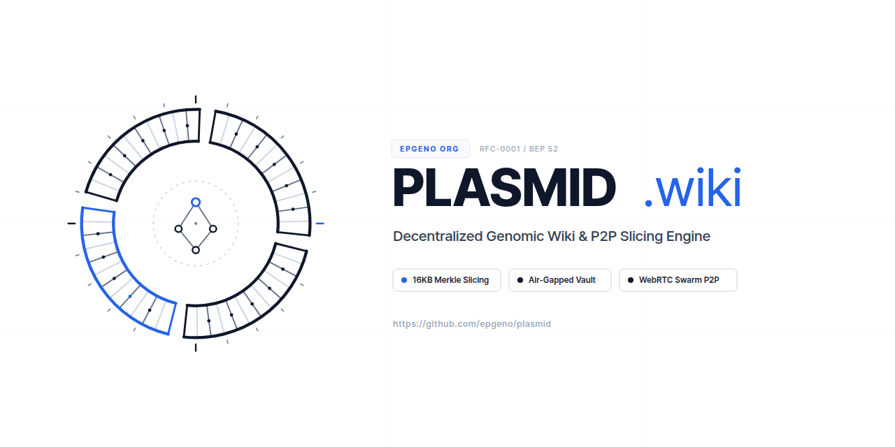

<div align="center">



# 🧬 Plasmid (플라스미드)

**탈중앙 유전체 위키 & 머클 레인지 슬라이싱 스트리밍 엔진**

**[ English ](README.md)** • **[ 한국어 ](README.ko.md)**

<p align="center">
  <a href="https://github.com/epgeno/plasmid/actions/workflows/ci.yml"></a>
  <a href="https://github.com/epgeno/plasmid/blob/main/LICENSE"></a>
  <a href="https://plasmid.wiki"></a>
  <a href="docs/rfc/0001-container-spec.md"></a>
  <a href="docs/rfc/0002-privacy-and-airgap-isolation.md"></a>
</p>

</div>

---

## 🏛️ 플라스미드(Plasmid)란 무엇인가요?

**플라스미드**(`plasmid.wiki`)는 현대 인간 유전체학이 직면한 세 가지 실존적 위기를 극복하기 위해 설계된 오픈소스 탈중앙 유전체 지식 메쉬 및 P2P 스트리밍 엔진입니다:

1. **소비자 유전체 기업 파산 및 프라이버시 붕괴**: 23andMe 등 영리 기업들의 연쇄 파산과 1,500만 명의 DNA 데이터 경매 사태 이후, 사용자의 원시 WGS/VCF 파일이 절대 외부 클라우드로 유출되지 않는 **Zero-Network 로컬 에어갭 분석 환경**이 필수화되었습니다.
2. **개방형 유전체 지식의 고사(Decay)**: 2019년 MyHeritage의 SNPedia 인수 이후 커뮤니티 기여가 잠기고 의약품/질환 변이 정보가 검열·방치되면서, 검열 불가능하고 영구 보존되는 오픈소스 분산 위키가 필요해졌습니다.
3. **연구 랩실의 대역폭(Egress) 비용 장벽**: 수십~수백 GB에 달하는 BAM/CRAM 데이터를 JBrowse 등으로 외부에 공개할 때 발생하는 막대한 AWS S3 트래픽 비용을 **PMTiles 스타일 단일 컨테이너(`.plasmid`)**와 **BitTorrent v2 (BEP 52) WebRTC P2P 스웜**을 통해 90% 이상 절감합니다.

---

## ⚡ 핵심 아키텍처 4대 기둥

```
┌────────────────────────────────────────────────────────────────────────┐
│                      플라스미드 하이브리드 메쉬 시스템                 │
├──────────────────────────────────┬─────────────────────────────────────┤
│      공개 P2P 스웜 계층          │     로컬 에어갭 볼트 (OPFS)         │
├──────────────────────────────────┼─────────────────────────────────────┤
│ • ClinVar/ACMG 불변 임상 SSOT    │ • 유저 개인 WGS / BAM / CRAM / VCF  │
│ • 16KB 머클 리프 청크 스트리밍   │ • 브라우저 WASM 서열 정렬 엔진      │
│ • BitTorrent v2 BEP 52 스웜      │ • 네트워크 외부 송신 0 바이트 보장  │
│ • Cloudflare R2 고속 뷰포트      │ • 로컬 퍼스트 변이 판독 및 리포팅   │
└──────────────────────────────────┴─────────────────────────────────────┘
```

* **16KB 머클 레인지 슬라이싱**: 파일 전체를 다운로드할 필요 없이, 브라우저가 필요한 염기서열 영역만 HTTP Range Request와 WebRTC P2P로 16KB 단위로 슬라이싱하여 로드합니다.
* **비잔틴 방어 WebRTC 스웜**: 악의적인 피어가 제공하는 변조되거나 오염된 청크를 WASM 디코더에 전달하기 전에 SHA-256 머클 루트 증명을 통해 즉각 차단합니다.
* **물리적 에어갭 격리 (`plasmid-vault`)**: 사용자의 유전체 데이터는 브라우저 격리 저장소(OPFS/IndexedDB)에만 유지되며, 외부 네트워크로는 오직 공개 변이 어노테이션(ClinVar)만 요청합니다.
* **임상 판정 불변 SSOT 레이어**: NCBI ClinVar 및 ACMG 가이드라인의 병원성 분류는 읽기 전용 불변 계층으로 고정하여 위키 반달리즘을 원천 방어합니다.

---

## 📁 워크스페이스 크레이트 및 모듈

| 경로 | 크레이트 / 앱 | 설명 |
| :--- | :--- | :--- |
| `crates/plasmid-format` | `plasmid-format` | 128B 고정 헤더, SHA-256 머클 트리(BEP 52), 32B 고밀도 인덱스 디렉터리 구현. |
| `crates/plasmid-core` | `plasmid-core` | 유전체 좌표 쿼리 플래너, Range Slicing 코디네이터, `noodles` VCF 파서. |
| `crates/plasmid-swarm` | `plasmid-swarm` | WebRTC P2P 청크 교환 프로토콜, RTT 기반 피어 선택, 비잔틴 청크 검증. |
| `crates/plasmid-cli` | `plasmid-cli` | 공식 CLI 컴파일러, 컨테이너 헤더 인스펙터, 머클 검증기 및 슬라이스 쿼리 도구. |
| `apps/web` | `plasmid-web` | React 19 + Vite 6 초경량 공식 웹 클라이언트 (Pure White 플랫 모노크롬 UI). |
| `docs/rfc` | RFC 공식 규격 | 단일 컨테이너 포맷(RFC-0001) 및 에어갭 보안(RFC-0002) 명세서. |

---

## 🚀 빠른 시작

### 1. Rust 워크스페이스 빌드 및 테스트

```bash
# 리포지토리 클론
git clone https://github.com/epgeno/plasmid.git
cd plasmid

# 전체 워크스페이스 테스트
cargo test --workspace

# 린터 및 코드 포맷팅 검사
cargo fmt --all -- --check
cargo clippy --workspace --all-targets -- -D warnings
```

### 2. React 19 웹 클라이언트 로컬 실행

```bash
cd apps/web
pnpm install
pnpm dev
```
브라우저에서 [http://localhost:5173](http://localhost:5173)으로 접속합니다.

### 3. Plasmid CLI 도구 사용법

```bash
# VCF, FASTA 및 어노테이션 노트를 .plasmid 단일 파일로 패키징
cargo run -p plasmid-cli -- build --vcf sample.vcf --fasta ref.fa --annotation notes.md -o sample.plasmid

# 128B 고정 헤더, 인덱스 레이아웃 및 메타데이터 조회
cargo run -p plasmid-cli -- inspect sample.plasmid --entries

# SHA-256 머클 트리 및 16KB 청크 암호학적 무결성 검증
cargo run -p plasmid-cli -- verify sample.plasmid --verbose

# 염색체 좌표 슬라이싱 및 HTTP Range 요청 바이트 플랜 생성
cargo run -p plasmid-cli -- query sample.plasmid --chr chr7 --start 140453100 --end 140453200
```

---

## 📜 RFC 공식 규격서

* [**RFC-0001: .plasmid 단일 컨테이너 아카이브 규격**](docs/rfc/0001-container-spec.md): 인덱스, 16KB 머클 청크, 참조 서열 블록을 단일 파일로 패키징하는 바이너리 레이아웃.
* [**RFC-0002: 프라이버시, 에어갭 격리 및 비잔틴 방어 규격**](docs/rfc/0002-privacy-and-airgap-isolation.md): 위협 모델링, 로컬 퍼스트 샌드박스 아키텍처, 좌표계 드리프트 방지 대책.

---

## ⚖️ 라이선스

다음 두 라이선스 중 선택하여 사용하실 수 있습니다:
* Apache License, Version 2.0 ([LICENSE-APACHE](LICENSE-APACHE) 또는 http://www.apache.org/licenses/LICENSE-2.0)
* MIT license ([LICENSE-MIT](LICENSE-MIT) 또는 http://opensource.org/licenses/MIT)
